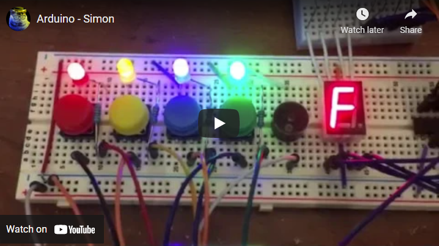

# Simon Arduino
 A Electronic Simon game recreated using the Arduino (C, C++)
 
 

 
- The program generates a sequence of ten random numbers from zero to three, signifying the four colors, for each game.
- Starting from one per round, it then add one extra color from the sequence for every successful game until it reaches ten.
- The game will play the winning sequence when the total score reaches 10.
- If a mistake is made then the game will stop and play the losing sequence.
- If there's any other error it will display an "F" and start flashing red.

Check it out:

